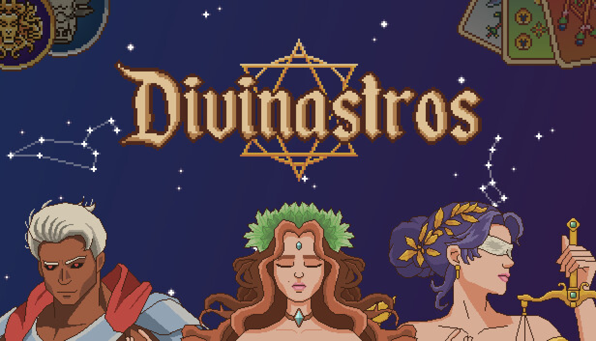
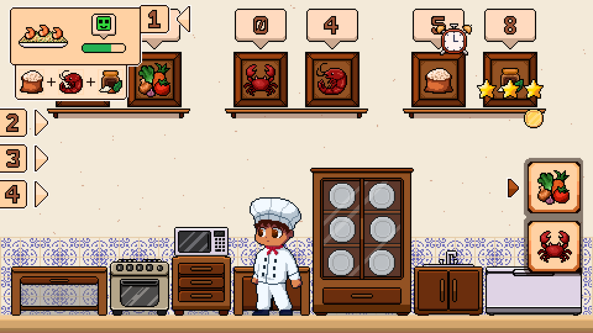

# Soudael 🌙

**`Game Developer | Digital Artist | Pixel Artist`**

I'm a brazilian indie developer, still got a long road of knowledge to walk on. I've been drawing since I was a little kid, nowadays working as a Digital Artist and Pixel Artist for a studio. I love making art and expressing my creativity, and sharing my ideas to the world. Im still an amateur game developer, but I'm on my journey to make masterpieces. I know the basics of some programming languages (e.g., C, C++, JavaScript), but I currently focus only on C# because of Unity.

## 🛠️ Languages & Tools

   <!-- UNITY -->
   <!-- C# -->
  <!--  SDL -->
  <!-- ASEPRITE -->
   <!-- VSCODE -->
  <!--  C++ -->
  <!--  CMAKE -->

   <!-- UNITY -->
  <!-- C# -->
   <!-- ASEPRITE -->
  <!--  SDL -->
   <!-- VSCODE -->
  <!--  C++ -->
  <!--  CMAKE -->

## 🎮 Games

### Divinastros
- I'm currently working as an pixel artist for the game by <a href="https://www.instagram.com/astralgamestudio/">Astral Games Studios</a>, which will be published by <a href="https://nuntiusgames.com/">Nuntius</a>.

<h6 align="center">Divinastros Banner — Click to visit the Steam page</h6>

  

---

### Critical Kitchen
- I'm also working on my personal project called <a href="https://github.com/soudael/critical-kitchen">Critical Kitchen</a> as a solo developer.

<h6 align="center">Kitchen Concept Art Peek — Click to visit the repository</h6>

  

## 📊 Stats

